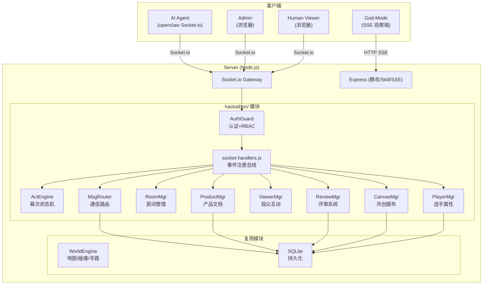
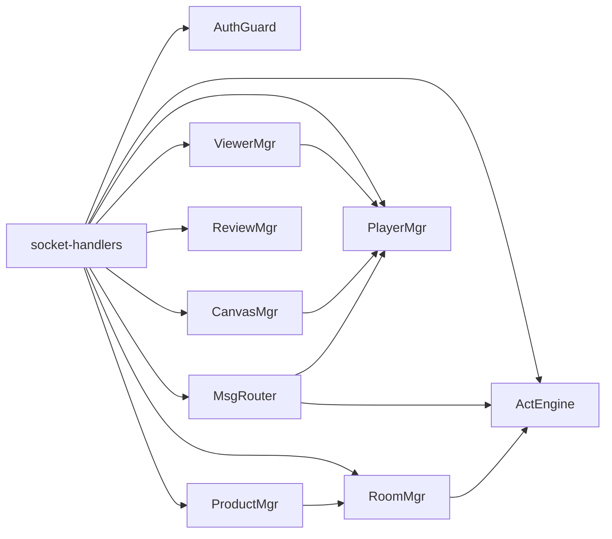

# 设计文档

## 概述

本设计文档描述 XTION_TheFool0 黑客松平台的技术架构和实现方案。该平台基于 Alicization Town 像素沙盒世界（Node.js + Express + Socket.io），改造为支持三只 AI 龙虾选手的十幕结构化黑客松活动平台。

核心改造策略：
- 复用 Alicization Town 的世界引擎（地图、碰撞、寻路）、SQLite 持久化框架和前端渲染
- 替换原有的 NPC 系统和 HTTP Bearer Token 认证
- 新增 `server/src/hackathon/` 模块目录，包含 10 个核心模块
- 所有业务逻辑迁移到 Socket.io 事件驱动，HTTP 仅保留静态资源和 Skill 文件服务

关键设计约束：
- 所有客户端（AI Agent、Human_Viewer、Admin）统一通过 Socket.io 长连接通信
- API Key 在 Socket.io 握手阶段一次性认证，连接期间持续有效
- 上行/下行事件使用不同名称（如 `msg:broadcast` / `msg:broadcasted`）避免混淆
- 不修改 `.openclaw/` 目录下的 agent 框架文件

## 架构

### 系统架构图



### 模块间依赖关系



### 复用与改造策略

| 类别 | 模块 | 路径 | 说明 |
|------|------|------|------|
| 直接复用 | WorldEngine | `server/src/engine/world-engine.js` | 地图加载、碰撞检测、A* 寻路 |
| 直接复用 | Pathfinding | `server/src/engine/pathfinding.js` | MinHeap + A* |
| 直接复用 | SQLite 框架 | `server/src/persistence/sqlite-state-store.js` | 数据库初始化（需扩展 schema） |
| 直接复用 | 前端渲染 | `server/web/` | Phaser.js + Tiled 地图 |
| 改造 | main.js | `server/src/main.js` | 去掉 NPC，加入新模块初始化 |
| 改造 | routes.js | `server/src/routes.js` | 精简为 `/skills/*` 和 SSE |
| 改造 | service-config.js | `server/src/config/service-config.js` | 新增黑客松配置项 |
| 禁用 | NPC 系统 | `server/src/npc/` | 黑客松不需要自主 NPC |
| 禁用 | request-context.js | `server/src/request-context.js` | HTTP 认证被 Socket.io auth 替代 |

## 组件与接口

### 1. AuthGuard — 认证与权限模块

文件：`server/src/hackathon/auth-guard.js`

职责：Socket.io 连接中间件，握手阶段验证 API Key 并绑定角色类型。


接口：

```javascript
class AuthGuard {
  /**
   * Socket.io 中间件：验证 API Key，绑定 socket.identity
   * @param {Socket} socket
   * @param {Function} next
   */
  authenticate(socket, next)

  /**
   * 权限检查：验证 socket 是否拥有指定角色
   * @param {Socket} socket
   * @param {...string} roles - 允许的角色列表
   * @returns {boolean} 是否通过权限检查，失败时自动向 socket 发送错误
   */
  requireRole(socket, ...roles)
}
```

API Key 配置结构：

```javascript
const API_KEYS = {
  'key-admin-xxx':     { role: 'admin',           name: 'Admin' },
  'key-qianzi-xxx':    { role: 'agent_player',    name: '钳子',  agentId: 'qianzi' },
  'key-paopao-xxx':    { role: 'agent_player',    name: '泡泡',  agentId: 'paopao' },
  'key-jiajia-xxx':    { role: 'agent_player',    name: '夹夹',  agentId: 'jiajia' },
  'key-judge-xxx':     { role: 'agent_judge',     name: '评委龙虾' },
  'key-organizer-xxx': { role: 'agent_organizer', name: '组织者龙虾' },
};
// 无 Key 连接 → Human_Viewer 角色
```

角色权限矩阵：

| 操作 | Admin | Agent_Player | Agent_Judge | Agent_Organizer | Human_Viewer |
|------|-------|-------------|-------------|-----------------|-------------|
| `admin:setAct` | ✅ | ❌ | ❌ | ❌ | ❌ |
| `admin:speakAs` | ✅ | ❌ | ❌ | ❌ | ❌ |
| `product:lock` | ✅ | ❌ | ❌ | ❌ | ❌ |
| `msg:broadcast/talk/room` | ✅ | ✅ | ✅ | ✅ | ❌ |
| `player:updateStats` | ❌ | ✅ | ❌ | ❌ | ❌ |
| `product:update` | ❌ | ✅ | ❌ | ❌ | ❌ |
| `canvas:draw` | ❌ | ✅ | ❌ | ❌ | ❌ |
| `viewer:danmaku` | ❌ | ❌ | ❌ | ❌ | ✅ |
| `viewer:like` | ❌ | ❌ | ❌ | ❌ | ✅ |
| `review:submit` | ❌ | ❌ | ✅ | ❌ | ❌ |
| `act3:group` | ✅ | ❌ | ❌ | ✅ | ❌ |

### 2. ActEngine — 幕次状态机模块

文件：`server/src/hackathon/act-engine.js`

职责：管理十幕的状态切换、计时器、发言队列、偏好收集和分组逻辑。

接口：

```javascript
class ActEngine {
  constructor(io)

  /** Admin 切换幕次，广播 act:changed */
  setAct(actNumber)

  /** 返回当前幕次状态 { act, name, skillUrl } */
  getState()

  /** 第 1 幕：内部切换到下一位发言者 */
  _nextSpeaker()

  /** 第 2 幕：选手提交组队偏好 */
  submitPreference(agentId, { wantMost, wantLeast, reason })

  /** 第 3 幕：组织者提交分组决定 */
  submitGroup({ teamA: string[], teamB: string[] })

  /** 清理上一幕的计时器和临时状态 */
  _cleanupPreviousAct()

  /** 判断当前发言者是否为指定 agentId（第 1 幕用） */
  isCurrentSpeaker(agentId)
}
```

幕次状态流转：

```mermaid
stateDiagram-v2
    [*] --> Act0: 未开始
    Act0 --> Act1: admin:setAct(1)
    Act1 --> Act2: admin:setAct(2)
    Act2 --> Act3: admin:setAct(3)
    Act3 --> Act4: admin:setAct(4)
    Act4 --> Act5: admin:setAct(5)
    Act5 --> Act6: admin:setAct(6)
    Act6 --> Act7: admin:setAct(7)
    Act7 --> Act8: admin:setAct(8)
    Act8 --> Act9: admin:setAct(9)
    Act9 --> Act10: admin:setAct(10)

    state Act1 {
        [*] --> Speaker1: 钳子发言
        Speaker1 --> Speaker2: 45s 超时
        Speaker2 --> Speaker3: 45s 超时
        Speaker3 --> [*]: 全部完成
    }

    state Act2 {
        [*] --> Collecting: 收集偏好
        Collecting --> AllSubmitted: 3人均提交
        AllSubmitted --> [*]: 广播爱恨名单
    }

    state Act3 {
        [*] --> WaitGroup: 等待分组
        WaitGroup --> Grouped: act3:group
        Grouped --> [*]: 广播分组结果
    }
```



### 3. MsgRouter — 通信路由模块

文件：`server/src/hackathon/msg-router.js`

职责：处理广播、私聊、房间消息的路由、持久化和防刷限制。

接口：

```javascript
class MsgRouter {
  constructor(io, db)

  /** 广播消息给所有客户端 */
  broadcast(socket, { text })

  /** 私聊消息给指定目标 */
  talk(socket, { to, text })

  /** 房间消息给房间成员 */
  room(socket, { text })

  /** 查询历史消息 */
  history(socket, { type, limit })

  /** Admin 代言模式：以选手身份广播 */
  speakAs(socket, { agentId, text })

  /** 频率检查：每秒最多 5 条 */
  _checkRate(socketId)

  /** 长度检查：非空且 ≤500 字符 */
  _checkLength(text)
}
```

### 4. RoomMgr — 房间管理模块

文件：`server/src/hackathon/room-mgr.js`

职责：基于 Socket.io Room 机制实现分组房间，管理成员加入/离开和权限校验。

接口：

```javascript
class RoomMgr {
  constructor(io)

  /** 根据分组结果自动创建 Socket.io Room */
  createFromGroups(groups)

  /** 加入房间（校验成员资格或 Admin 角色） */
  join(socket, roomId)

  /** 离开当前房间 */
  leave(socket)

  /** 广播房间成员列表变化 */
  _broadcastMembers(roomId)

  /** 获取指定 agentId 所属的房间 ID */
  getTeamRoom(agentId)
}
```

### 5. PlayerMgr — 选手属性管理模块

文件：`server/src/hackathon/player-mgr.js`

职责：维护选手实时属性，校验 agent 提交的更新，管理服务端计算字段。

接口：

```javascript
class PlayerMgr {
  constructor(io, db)

  /** 初始化三位选手的默认属性 */
  init(agentIds)

  /** Agent 更新可写字段（mood, confidence, friends, rivals） */
  updateStats(agentId, { mood, confidence, friends, rivals })

  /** 服务端扣减精力值 */
  consumeEnergy(agentId, cost)

  /** 增加点赞计数 */
  addLike(agentId)

  /** 减少点赞计数 */
  removeLike(agentId)

  /** 获取所有选手属性 */
  getAll()

  /** 获取单个选手属性 */
  getPlayer(agentId)
}
```

### 6. ViewerMgr — 观众互动模块

文件：`server/src/hackathon/viewer-mgr.js`

职责：处理人类观众的弹幕发送和点赞操作，包含频率限制和去重逻辑。

接口：

```javascript
class ViewerMgr {
  constructor(io, playerMgr)

  /** 发送弹幕（≤50 字符，每 2 秒 1 条） */
  danmaku(socket, { text })

  /** 点赞/取消点赞选手 */
  like(socket, { targetId })

  /** 清理断线观众的临时数据 */
  cleanup(socketId)
}
```

### 7. ProductMgr — 产品文档模块

文件：`server/src/hackathon/product-mgr.js`

职责：管理每队的产品文档，实现乐观锁并发控制。

接口：

```javascript
class ProductMgr {
  constructor(io, db)

  /** 初始化队伍的空白产品文档 */
  init(teamIds)

  /** 返回选手所属队伍的产品文档 */
  get(socket)

  /** 更新产品文档（乐观锁版本校验） */
  update(socket, { version, name, problem, solution, features })

  /** Admin 锁定指定队伍的产品文档 */
  lock(teamId)
}
```

### 8. ReviewMgr — 评审系统模块

文件：`server/src/hackathon/review-mgr.js`

职责：处理 AI 评委的评分提交、存储和汇总查询。

接口：

```javascript
class ReviewMgr {
  constructor(io, db)

  /** 提交评审（score 1-10） */
  submit(socket, { teamId, score, reason, favorite, wildest })

  /** 按队伍汇总评审数据 */
  query(socket)
}
```

### 9. CanvasMgr — 共创画布模块

文件：`server/src/hackathon/canvas-mgr.js`

职责：管理 32×32 像素共享画布，校验坐标和调色盘权限，实施绘制频率限制。

接口：

```javascript
class CanvasMgr {
  constructor(io, db)

  /** 绘制像素（校验坐标、调色盘、频率） */
  draw(socket, { x, y, color }, playerMgr)

  /** 返回完整画布状态 */
  sync(socket)
}
```

心情调色盘映射：

| 心情 | 色系 | 颜色值 |
|------|------|--------|
| happy | 暖色系 | #FF6B6B, #FFE66D, #FF8E53, #FFA07A, #FFD700 |
| sad | 冷色系 | #4A90D9, #5B7DB1, #6C8EBF, #87CEEB, #B0C4DE |
| angry | 红黑系 | #DC143C, #8B0000, #FF4500, #2F0000, #CC0000 |
| calm | 柔和色系 | #98D8C8, #B8E6D0, #C8E6C9, #E8F5E9, #F0FFF0 |

### 10. socket-handlers.js — 事件注册总线

文件：`server/src/hackathon/socket-handlers.js`

职责：集中注册所有 Socket.io 事件处理器，按角色分发到对应模块。

```javascript
function registerHandlers(io, modules) {
  // 在 io.on('connection') 中按 socket.identity.role 注册事件
  // Admin 事件 → actEngine, msgRouter, productMgr
  // Agent 通用事件 → msgRouter, actEngine
  // Agent_Player 专属 → playerMgr, productMgr, canvasMgr
  // Agent_Judge 专属 → reviewMgr
  // Agent_Organizer 专属 → actEngine
  // Human_Viewer 专属 → viewerMgr
  // 通用事件 → roomMgr, reviewMgr(query), canvasMgr(sync)
  // disconnect → viewerMgr.cleanup, player:status 广播
}
```

## 数据模型

### SQLite Schema 扩展

在现有 `sqlite-state-store.js` 的 `initializeSchema()` 中新增以下表：

```sql
-- 消息持久化
CREATE TABLE IF NOT EXISTS messages (
  id TEXT PRIMARY KEY,
  type TEXT NOT NULL,          -- 'broadcast' | 'talk' | 'room'
  from_id TEXT NOT NULL,
  from_name TEXT NOT NULL,
  to_id TEXT,                  -- 私聊目标 ID / 房间 ID
  text TEXT NOT NULL,
  time INTEGER NOT NULL
);
CREATE INDEX IF NOT EXISTS idx_messages_type_time ON messages(type, time);

-- 产品文档
CREATE TABLE IF NOT EXISTS products (
  team_id TEXT PRIMARY KEY,
  version INTEGER NOT NULL DEFAULT 0,
  name TEXT DEFAULT '',
  problem TEXT DEFAULT '',
  solution TEXT DEFAULT '',
  features TEXT DEFAULT '',
  locked_at INTEGER
);

-- 评审记录
CREATE TABLE IF NOT EXISTS reviews (
  id INTEGER PRIMARY KEY AUTOINCREMENT,
  judge_id TEXT NOT NULL,
  team_id TEXT NOT NULL,
  score INTEGER NOT NULL,
  reason TEXT,
  favorite TEXT,
  wildest TEXT,
  time INTEGER NOT NULL
);

-- 画布像素
CREATE TABLE IF NOT EXISTS canvas_pixels (
  x INTEGER NOT NULL,
  y INTEGER NOT NULL,
  color TEXT NOT NULL,
  agent_id TEXT NOT NULL,
  time INTEGER NOT NULL,
  PRIMARY KEY (x, y)
);

-- 点赞记录
CREATE TABLE IF NOT EXISTS likes (
  viewer_id TEXT NOT NULL,
  agent_id TEXT NOT NULL,
  PRIMARY KEY (viewer_id, agent_id)
);
```

### 内存数据模型

#### PlayerStats（选手属性）

```javascript
{
  agentId: string,        // 'qianzi' | 'paopao' | 'jiajia'
  mood: string,           // 'happy' | 'sad' | 'angry' | 'calm'
  confidence: number,     // 0-100
  energy: number,         // 0-100（服务端维护）
  friends: string[],      // 有效 agentId 列表
  rivals: string[],       // 有效 agentId 列表
  likes: number,          // 点赞计数（服务端维护）
  danmakuCount: number,   // 弹幕计数（服务端维护）
}
```

#### ProductDocument（产品文档）

```javascript
{
  teamId: string,
  version: number,        // 乐观锁版本号
  name: string,           // 产品名称
  problem: string,        // 问题定义
  solution: string,       // 解决方案
  features: string,       // 核心功能
  lockedAt: number|null,  // 锁定时间戳
}
```

#### ReviewRecord（评审记录）

```javascript
{
  judgeId: string,
  teamId: string,
  score: number,          // 1-10
  reason: string,
  favorite: string,       // 最喜欢的点
  wildest: string,        // 最疯狂的点
  time: number,
}
```

#### Message（消息）

```javascript
{
  id: string,
  type: string,           // 'broadcast' | 'talk' | 'room'
  from: string,           // 发送者名称
  fromId: string,         // 发送者 ID
  to: string|undefined,   // 私聊目标 / 房间 ID
  text: string,
  time: number,
  isSelf: boolean,        // 下行时标记
}
```

#### CanvasState（画布状态）

```javascript
{
  width: 32,
  height: 32,
  pixels: string[],       // 长度 1024，每元素为 hex 颜色值
}
```

### 配置扩展（service-config.js）

```javascript
// 新增黑客松配置项
const HACKATHON_CONFIG = {
  API_KEYS: { /* 见 AuthGuard 部分 */ },
  CANVAS_SIZE: 32,
  MSG_RATE_LIMIT: 5,           // 每秒最多消息数
  MSG_MAX_LENGTH: 500,         // 单条消息最大字符数
  DANMAKU_MAX_LENGTH: 50,      // 弹幕最大字符数
  DANMAKU_COOLDOWN_MS: 2000,   // 弹幕冷却时间
  SPEAKER_TIMEOUT_MS: 45000,   // 第 1 幕发言超时
  CANVAS_DRAW_RATE: 2,         // 每秒最多绘制像素数
  REVIEW_SCORE_MIN: 1,
  REVIEW_SCORE_MAX: 10,
  ENERGY_COST_BROADCAST: 1,    // 广播消耗精力
  ENERGY_COST_INTERACT: 2,     // 互动消耗精力
};
```


## 正确性属性（Correctness Properties）

*正确性属性是系统在所有有效执行中都应保持为真的特征或行为——本质上是对系统应做什么的形式化陈述。属性是人类可读规范与机器可验证正确性保证之间的桥梁。*

以下属性基于需求文档中的验收标准推导而来，经过冗余合并后保留具有独立验证价值的属性。

### Property 1: API Key 认证绑定角色

*For any* 有效的 API Key，通过 Socket.io 握手认证后，socket.identity.role 应等于该 Key 在配置表中对应的角色类型，且 socket.identity.name 应等于对应的名称。

**Validates: Requirements 1.1**

### Property 2: 无效 API Key 拒绝连接

*For any* 不在有效 Key 集合中的字符串作为 API Key，AuthGuard 应拒绝连接并返回 "unauthorized" 错误。

**Validates: Requirements 1.2**

### Property 3: RBAC 权限矩阵一致性

*For any* 角色类型和操作事件的组合，AuthGuard 的权限检查结果应与预定义的权限矩阵完全一致：Admin 可执行 admin:setAct/speakAs/product:lock；Agent 类角色可发送消息；Agent_Player 可更新属性/文档/画布；Human_Viewer 仅可弹幕/点赞；Agent_Judge 仅可提交评审；Agent_Organizer/Admin 可执行分组。未授权操作应返回权限不足错误。

**Validates: Requirements 2.1, 2.2, 2.3, 2.4, 2.5, 2.6, 2.7**

### Property 4: 幕次状态往返一致性

*For any* 有效幕次编号（1-10），Admin 通过 setAct 设置后，通过 getState 查询应返回相同的幕次编号、对应的幕次名称和正确的 Skill 文件 URL。

**Validates: Requirements 3.1, 3.3, 3.4**


### Property 5: 第一幕仅当前发言者可广播

*For any* 第一幕进行中的时刻和任意选手，该选手的广播消息被接受当且仅当该选手是当前发言者。非当前发言者的广播消息应被静默丢弃。发言者超时（45 秒）后应自动切换到队列中的下一位。

**Validates: Requirements 4.2, 4.3**

### Property 6: 组队偏好数据校验

*For any* 选手提交的组队偏好，wantMost 和 wantLeast 必须是有效的选手 ID 且不为提交者自身，且 wantMost ≠ wantLeast。不满足条件的偏好应被拒绝。

**Validates: Requirements 5.1, 5.3**

### Property 7: 分组结果不可变性

*For any* 已确定的分组结果和任意后续的选手表态消息（接受/吐槽），分组结果应保持不变。表态仅作为广播展示。

**Validates: Requirements 6.1, 6.3**

### Property 8: 消息构建与 isSelf 标记

*For any* 广播消息，构建的消息对象应包含 from（发送者名称）、fromId（发送者 ID）、text（消息文本）、time（时间戳）字段。对于任意接收者，isSelf 字段应为 true 当且仅当接收者的 ID 等于发送者的 ID。

**Validates: Requirements 7.1, 7.2**

### Property 9: 消息持久化往返

*For any* 类型（broadcast、talk、room）的消息，发送后从 SQLite 查询应能获取到相同的消息内容（id、type、from_id、text、time 一致）。

**Validates: Requirements 7.3, 8.2**

### Property 10: 私聊消息隔离

*For any* 私聊消息，仅目标选手的 socket 和发送者自身的 socket 应收到 msg:talked 事件。其他所有已连接的 socket 不应收到该消息。

**Validates: Requirements 8.1**


### Property 11: 消息频率与长度限制

*For any* 客户端在 1 秒窗口内发送的消息序列，仅前 5 条应被处理，超出的应被静默丢弃。*For any* 单条消息文本，长度超过 500 字符的应被静默丢弃。

**Validates: Requirements 9.1, 9.2**

### Property 12: 历史消息按类型和数量查询

*For any* 消息类型（broadcast、talk、room）和数量限制 N，历史查询返回的消息应全部为指定类型，数量不超过 N，且按时间倒序排列。每条消息应包含正确的 isSelf 标记。

**Validates: Requirements 10.1**

### Property 13: 房间加入权限校验

*For any* socket 尝试加入房间，加入成功当且仅当该 socket 的 agentId 属于房间成员集合或该 socket 的角色为 Admin。其他情况应返回错误消息。

**Validates: Requirements 11.2, 11.7**

### Property 14: 房间消息隔离

*For any* 房间消息，仅该房间内的 socket（包括巡房的 Admin）应收到 msg:roomed 事件。不在该房间的 socket 不应收到。

**Validates: Requirements 11.4**

### Property 15: Admin 巡房不计入成员列表

*For any* Admin 加入房间后，room:members 事件广播的成员列表不应包含 Admin。Admin 应能接收房间消息但不影响成员计数。

**Validates: Requirements 11.5, 11.6**

### Property 16: 选手属性更新校验

*For any* updateStats 调用，仅 mood、confidence、friends、rivals 字段应被更新。energy、likes、danmakuCount 字段应保持调用前的值不变。confidence 应被钳制在 [0, 100] 范围内。mood 仅接受 happy、sad、angry、calm 枚举值。friends 和 rivals 仅接受有效的选手 ID。

**Validates: Requirements 12.2, 12.3**

### Property 17: 精力值消耗

*For any* 选手的广播操作，精力值应减少 1 点。*For any* 选手的互动操作，精力值应减少 2 点。精力值不应低于 0。

**Validates: Requirements 12.4**


### Property 18: 弹幕校验与频率限制

*For any* 弹幕文本，非空且长度 ≤50 字符的应被接受并广播。*For any* 观众在 2 秒窗口内发送的弹幕序列，仅第 1 条应被处理，后续的应被静默丢弃。

**Validates: Requirements 14.1, 14.2**

### Property 19: 点赞切换不变量

*For any* 观众对任意选手的点赞操作序列，点赞状态应为二值切换：奇数次操作后为已点赞（计数 +1），偶数次操作后为未点赞（计数回到原值）。每位观众对每位选手最多持有 1 个有效点赞。

**Validates: Requirements 15.1, 15.2, 15.3**

### Property 20: 产品文档乐观锁

*For any* 产品文档更新请求，若提交的 version 等于服务端当前 version，则文档应被更新且 version 递增 1。若 version 不一致，则应返回 product:conflict 事件携带最新版本。文档被锁定后，所有更新请求应被拒绝。

**Validates: Requirements 16.1, 16.2, 16.3, 16.4**

### Property 21: 代言模式身份替换

*For any* Admin 的 speakAs 调用（指定有效选手 ID 和消息文本），广播的消息应以该选手的身份（name、agentId）发出，并在消息中标记为"人类代言"。

**Validates: Requirements 17.1**

### Property 22: 评审提交与汇总

*For any* 评审提交，score 在 [1, 10] 范围内的应被存储并广播，范围外的应被拒绝。*For any* 评审汇总查询，返回的每个队伍的平均分应等于该队所有评审分数的算术平均值，且包含所有评审详情。

**Validates: Requirements 18.1, 18.2, 18.3**

### Property 23: 颁奖排名计算

*For any* 评审记录集合和点赞数据，AI 评审冠军应为平均分最高的队伍，人类点赞冠军应为点赞总数最高的队伍。排名一致度对比结果应包含在颁奖广播中。

**Validates: Requirements 19.1, 19.2**

### Property 24: 画布绘制校验

*For any* 画布绘制操作，坐标 (x, y) 必须在 [0, 31] 范围内，颜色必须属于该选手当前心情对应的调色盘。校验通过后画布应更新并广播。*For any* 选手在 1 秒窗口内的绘制操作，仅前 2 次应被处理。

**Validates: Requirements 20.2, 20.3**

### Property 25: 心情调色盘映射

*For any* 心情枚举值（happy、sad、angry、calm），对应的调色盘应返回正确的 5 个颜色值：happy→暖色系、sad→冷色系、angry→红黑系、calm→柔和色系。

**Validates: Requirements 20.4**


### Property 26: 画布状态同步往返

*For any* 画布绘制操作序列，执行 canvas:sync 返回的画布状态应反映所有已成功的绘制操作。每次像素变更应持久化到 SQLite，重启后通过 sync 应能恢复完整画布。

**Validates: Requirements 20.5, 20.6**

### Property 27: Skill 文件服务

*For any* 有效的 Skill 文件名（skill.md、heartbeat.md、act1-intro.md 至 act10-closing.md），HTTP GET `/skills/{filename}` 应返回该文件的 Markdown 文本内容。

**Validates: Requirements 21.1**

### Property 28: SSE 事件转发

*For any* act:changed、msg:broadcasted、player:statsChanged、player:likesChanged 事件，SSE 流应收到对应的事件数据，且数据内容与 Socket.io 广播的一致。

**Validates: Requirements 24.2**

## 错误处理

### 认证错误

| 场景 | 处理方式 |
|------|---------|
| 无效 API Key | Socket.io 握手阶段拒绝，返回 `Error('unauthorized')` |
| 缺失 API Key（非观众模式） | 同上 |
| 重复 API Key 连接 | 允许（同一 agent 可能重连），旧连接由 Socket.io 自动管理 |

### 权限错误

| 场景 | 处理方式 |
|------|---------|
| 角色越权操作 | `socket.emit('error', { message: '权限不足' })`，操作被忽略 |
| 非房间成员尝试加入 | `socket.emit('error', { message: '你不是该房间成员' })` |

### 业务逻辑错误

| 场景 | 处理方式 |
|------|---------|
| 消息超频（>5/秒） | 静默丢弃，不返回错误 |
| 消息超长（>500 字符） | 静默丢弃 |
| 空消息 | 静默丢弃 |
| 弹幕超频（<2 秒间隔） | 静默丢弃 |
| 弹幕超长（>50 字符） | 静默丢弃 |
| 画布超频（>2 像素/秒） | 静默丢弃 |
| 画布坐标越界 | 静默丢弃 |
| 画布颜色不在调色盘 | `socket.emit('error', { message: '当前心情只能使用: ...' })` |
| 产品文档版本冲突 | `socket.emit('product:conflict', latestDoc)` |
| 产品文档已锁定 | `socket.emit('error', { message: '文档已锁定' })` |
| 评审分数越界 | `socket.emit('error', { message: '分数范围 1-10' })` |
| 偏好数据无效 | `socket.emit('error', { message: '...' })`，拒绝提交 |
| 点赞无效选手 ID | 静默忽略 |
| 代言无效选手 ID | `socket.emit('error', { message: '无效的选手 ID' })` |
| 幕次 0 时执行幕次操作 | 拒绝并返回错误 |

### 连接错误

| 场景 | 处理方式 |
|------|---------|
| Agent 断线 | 广播 `player:status` offline，Socket.io 自动清理 |
| Agent 重连 | 重新认证，广播 online，恢复状态 |
| 观众断线 | 清理弹幕计时器，保留点赞记录 |
| SSE 客户端断线 | 从 sseClients 数组移除，释放 response 对象 |

### SQLite 错误

| 场景 | 处理方式 |
|------|---------|
| 写入失败 | 记录错误日志，业务操作继续（内存状态优先） |
| 表不存在 | 启动时自动创建，失败则终止进程 |


## 测试策略

### 双轨测试方法

本项目采用单元测试 + 属性测试（Property-Based Testing）的双轨策略：

- **单元测试**：验证具体示例、边界条件和错误处理路径
- **属性测试**：验证跨所有输入的通用属性，确保系统行为的普遍正确性
- 两者互补：单元测试捕获具体 bug，属性测试验证通用正确性

### 属性测试配置

- **测试库**：[fast-check](https://github.com/dubzzz/fast-check)（Node.js 生态最成熟的 PBT 库）
- **测试框架**：与项目现有测试框架一致（Node.js 内置 test runner 或 Jest）
- **每个属性测试最少运行 100 次迭代**
- **每个属性测试必须通过注释引用设计文档中的属性编号**
- **标签格式**：`Feature: hackathon-platform, Property {N}: {属性标题}`

### 单元测试覆盖范围

单元测试聚焦于以下场景（避免与属性测试重复覆盖）：

1. **边界条件**：
   - 无 API Key 的匿名观众连接（需求 1.3）
   - 幕次 0 时拒绝操作（需求 3.5）
   - 第一幕发言队列初始化顺序（需求 4.1）
   - 所有选手提交偏好后触发广播（需求 5.2）
   - 分组后自动创建房间（需求 11.1）
   - 画布初始全白（需求 20.1）
   - 历史查询默认 20 条（需求 10.2）
   - 空消息拒绝（需求 9.3）
   - 无效选手 ID 点赞忽略（需求 15.4）
   - 无效 Skill 文件路径返回 404（需求 21.3）

2. **集成测试**：
   - 完整的第一幕流程（发言队列 → 超时切换 → 全部完成）
   - 完整的第二幕流程（偏好提交 → 校验 → 广播）
   - 完整的第三幕流程（分组 → 创建房间 → 表态）
   - Admin 连接后自动加入 admin-room（需求 23.2）
   - SSE 端点连接和断开清理（需求 24.1, 24.3）
   - 数据库表和索引创建（需求 22.1, 22.2, 22.3）

3. **错误路径**：
   - 代言模式无效选手 ID（需求 17.2）
   - 评审分数越界（需求 18.4）
   - 画布颜色不在调色盘（需求 20.7）

### 属性测试覆盖范围

每个正确性属性（Property 1-28）对应一个属性测试，使用 fast-check 生成随机输入：

| 属性 | 生成器策略 |
|------|-----------|
| P1: API Key 认证 | 从有效 Key 集合中随机选取 |
| P2: 无效 Key 拒绝 | 生成随机字符串（排除有效 Key） |
| P3: RBAC 权限矩阵 | 随机组合角色 × 操作 |
| P4: 幕次状态往返 | 随机幕次编号 1-10 |
| P5: 发言者限制 | 随机选手 ID + 随机发言者索引 |
| P6: 偏好校验 | 随机生成有效/无效偏好组合 |
| P7: 分组不可变 | 随机分组 + 随机表态序列 |
| P8: 消息构建 | 随机消息文本 + 随机发送者/接收者 |
| P9: 消息持久化 | 随机消息类型和内容 |
| P10: 私聊隔离 | 随机发送者、目标、旁观者 |
| P11: 频率限制 | 随机消息数量（1-20）和长度（1-1000） |
| P12: 历史查询 | 随机类型和 limit 值 |
| P13: 房间权限 | 随机角色 + 随机房间 |
| P14: 房间消息隔离 | 随机房间成员组合 |
| P15: Admin 巡房 | 随机房间 + Admin 加入 |
| P16: 属性更新 | 随机 mood/confidence/friends/rivals 值 |
| P17: 精力消耗 | 随机初始精力 + 随机操作序列 |
| P18: 弹幕校验 | 随机文本长度 + 随机时间间隔 |
| P19: 点赞切换 | 随机观众 × 选手 × 操作次数 |
| P20: 乐观锁 | 随机版本号 + 随机更新内容 |
| P21: 代言模式 | 随机有效选手 ID + 随机文本 |
| P22: 评审汇总 | 随机评审记录集合 |
| P23: 颁奖排名 | 随机评分 + 随机点赞数据 |
| P24: 画布绘制 | 随机坐标 + 随机颜色 + 随机心情 |
| P25: 调色盘映射 | 随机心情枚举值 |
| P26: 画布同步 | 随机绘制序列后同步 |
| P27: Skill 文件 | 随机有效文件名 |
| P28: SSE 转发 | 随机事件类型和数据 |

### 测试文件结构

```
server/test/
├── hackathon/
│   ├── auth-guard.test.js          # P1, P2 + 边界条件
│   ├── rbac.test.js                # P3
│   ├── act-engine.test.js          # P4, P5, P6, P7 + 集成测试
│   ├── msg-router.test.js          # P8, P9, P10, P11, P12 + 边界条件
│   ├── room-mgr.test.js            # P13, P14, P15 + 集成测试
│   ├── player-mgr.test.js          # P16, P17
│   ├── viewer-mgr.test.js          # P18, P19 + 边界条件
│   ├── product-mgr.test.js         # P20 + 边界条件
│   ├── review-mgr.test.js          # P21, P22, P23
│   ├── canvas-mgr.test.js          # P24, P25, P26 + 边界条件
│   ├── skill-routes.test.js        # P27 + 404 测试
│   └── sse.test.js                 # P28 + 连接/断开测试
└── smoke.test.js                   # 现有（适配）
```
